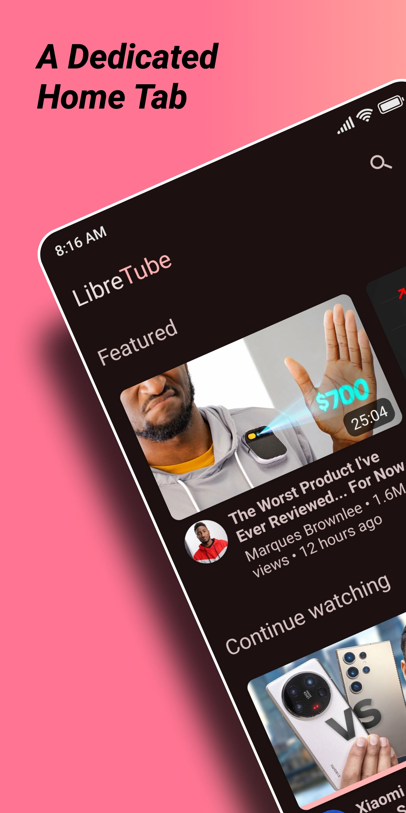
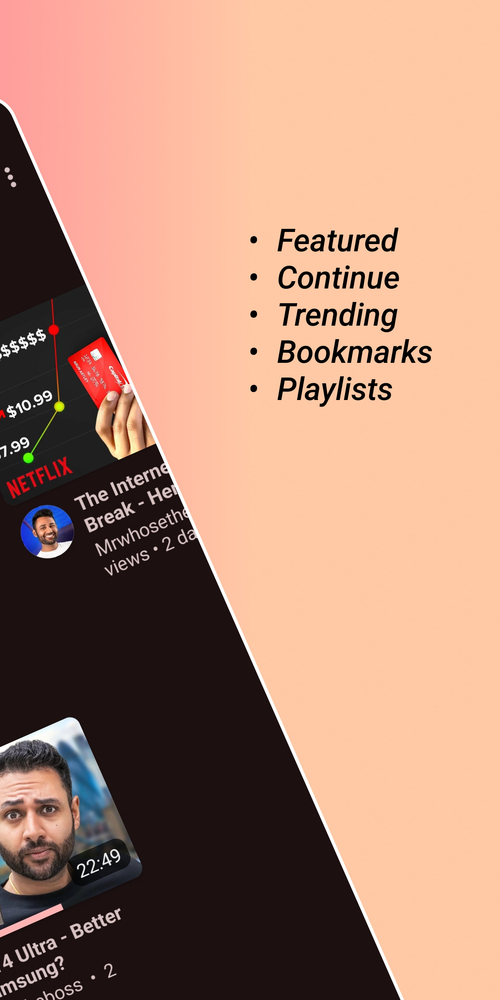
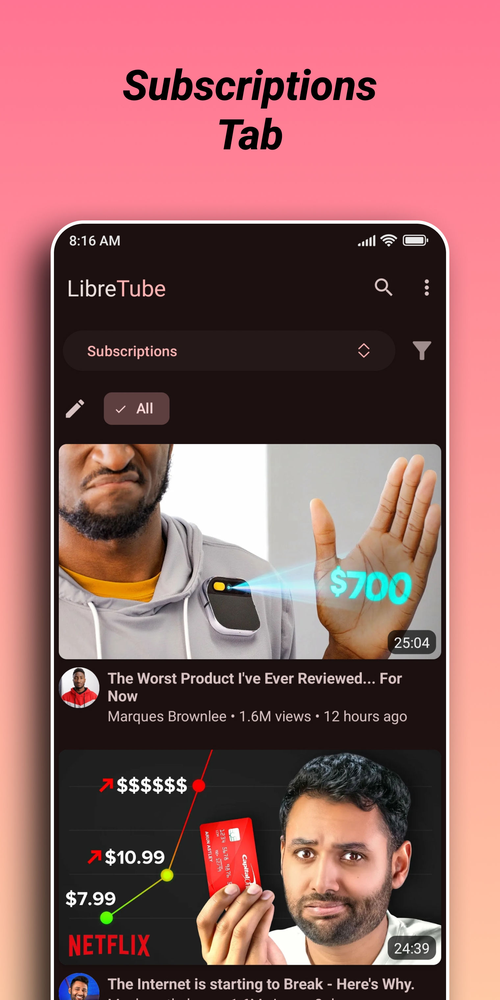
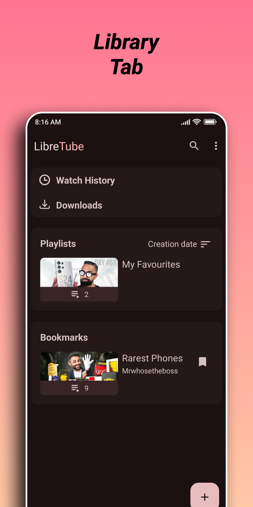
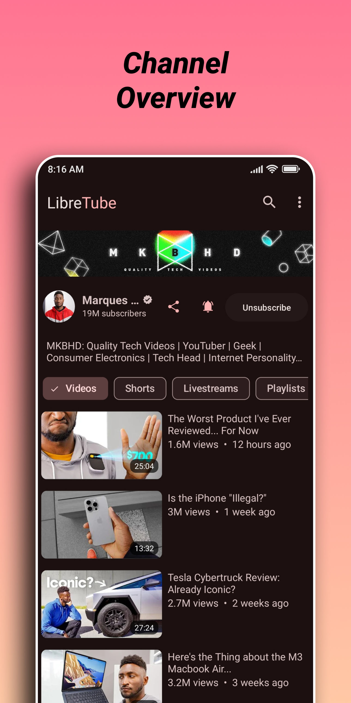

<div align="center">

# 🎬 LibreTube
### *Your Privacy-First YouTube Client*

[](https://github.com/Lycaon-Project/LibreTube/releases/latest)
[](https://github.com/Lycaon-Project/LibreTube/blob/master/LICENSE)
[](https://github.com/Lycaon-Project/LibreTube/releases)
[](https://github.com/Lycaon-Project/LibreTube/issues)

---

**[📥 Download](https://github.com/Lycaon-Project/LibreTube/releases/latest)** • **[📖 Documentation](https://github.com/Lycaon-Project/LibreTube/wiki)** • **[🐛 Report Bug](https://github.com/Lycaon-Project/LibreTube/issues/new)** • **[💡 Request Feature](https://github.com/Lycaon-Project/LibreTube/issues/new)**

</div>

---

## 📌 About This Project

LibreTube is a modern, privacy-focused YouTube client for Android that puts **you** in control of your data. Watch videos without ads, without tracking, and without compromising your privacy.

> **🎯 Our Mission**: Provide a fast, beautiful, and privacy-respecting alternative to the official YouTube app, with modern performance optimizations and cutting-edge features.

### ✨ Why Choose LibreTube?

- 🔒 **Zero Tracking** - We don't collect your personal data
- 🚀 **Lightning Fast** - Optimized for 120Hz displays and modern devices
- 🎨 **Beautiful Design** - Material 3 Expressive with stunning animations
- 🔋 **Battery Friendly** - Efficient background playback and downloads
- 🌐 **Offline Ready** - Download and watch videos anywhere

---

## 📸 Screenshots

<div align="center">

| Home | Player | Subscriptions | Library | Search |
|:---:|:---:|:---:|:---:|:---:|
|  |  |  |  |  |

</div>

---

## 🚀 Features

### Core Features

| Feature | Description | Status |
|---------|-------------|:------:|
| 🎥 **Ad-Free Playback** | Watch videos without interruptions | ✅ |
| 🔐 **Privacy First** | No tracking, no data collection | ✅ |
| 📱 **Subscriptions** | Follow your favorite channels | ✅ |
| 📚 **Playlists** | Create and manage your playlists | ✅ |
| ⬇️ **Downloads** | Save videos for offline viewing | ✅ |
| 🎵 **Background Play** | Listen to audio while using other apps | ✅ |
| 🔍 **Search** | Find any video quickly | ✅ |
| 📜 **History** | Track your watched videos | ✅ |

### Advanced Features

| Feature | Description | Status |
|---------|-------------|:------:|
| 🛡️ **SponsorBlock** | Automatically skip sponsored segments | ✅ |
| 👎 **Return YouTube Dislike** | See dislike counts on videos | ✅ |
| 🎯 **DeArrow** | Better titles and thumbnails | ✅ |
| 🌐 **Piped Integration** | Sync across devices (optional) | ✅ |
| 🎨 **Custom Themes** | Personalize your experience | ✅ |
| 📊 **Statistics** | Detailed playback information | ✅ |

### Performance Optimizations

| Optimization | Benefit |
|--------------|---------|
| ⚡ **120Hz Support** | Ultra-smooth scrolling and animations |
| 🧠 **Smart Caching** | Reduced memory usage and faster loading |
| 🔄 **Lazy Loading** | Efficient resource management |
| 📦 **Kotlin Sequences** | Optimized data processing |

---

## 📥 Installation

### Option 1: GitHub Releases (Recommended)

1. Visit the [Releases Page](https://github.com/Lycaon-Project/LibreTube/releases/latest)
2. Download the latest APK
3. Install on your Android device
4. Enjoy! 🎉

### Option 2: Build from Source

```bash
# Clone the repository
git clone https://github.com/Lycaon-Project/LibreTube.git

# Navigate to the project
cd LibreTube

# Build the APK
./gradlew assembleDebug

# Find the APK at:
# app/build/outputs/apk/debug/app-debug.apk
